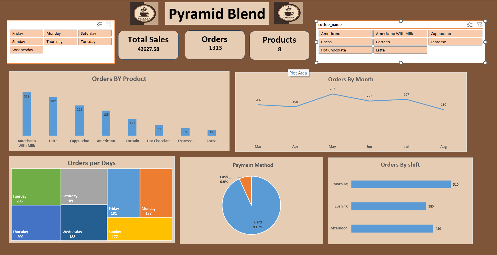

# ☕ Pyramid Blend - Coffee Sales Dashboard

### 📊 Project Overview
The **Pyramid Blend Dashboard** provides a clear overview of the coffee shop’s performance, analyzing **sales, orders, products, and customer behavior**.  
It helps management identify top-selling items, busiest days, and preferred payment methods to support better business decisions.

---

### 🎯 Objectives
- Analyze total sales, number of orders, and variety of products.
- Identify best-selling coffee products.
- Track sales trends over time (monthly performance).
- Understand customer behavior by day and shift.
- Compare payment method usage (Cash vs. Card).

---

### 📈 Key Insights
- **Total Sales:** 42,627.58  
- **Total Orders:** 1,313  
- **Products Sold:** 8  
- **Most Ordered Product:** Americano With Milk  
- **Busiest Day:** Tuesday  
- **Most Popular Shift:** Morning  
- **Preferred Payment Method:** Card (93.2%)

---

### 📅 Dashboard Sections
| Section | Visualization Type | Insight |
|----------|--------------------|----------|
| Orders by Product | Bar Chart | Shows top-selling coffee types |
| Orders by Month | Line Chart | Tracks order trends over months |
| Orders per Day | Tree Map | Highlights busiest days of the week |
| Payment Method | Pie Chart | Shows payment method distribution |
| Orders by Shift | Bar Chart | Compares performance across day shifts |

---

### 🛠️ Tools Used
- **Microsoft Excel / Power BI** – for dashboard creation  
- **Data Cleaning:** Excel formulas & filtering  
- **Visualization:** Interactive charts and slicers  

---

### 💡 Learnings
- Improved understanding of **data visualization techniques**.  
- Learned how to use **filters, slicers, and KPIs** effectively.  
- Practiced storytelling through data for **business decision-making**.

---

### 📸 Dashboard Preview

---

### 🚀 Future Enhancements
- Add monthly revenue growth KPIs.
- Integrate customer feedback data.
- Build a Power BI version with dynamic filtering.

---

### 👨‍💻 Created by
**Mohamed Eltmsah**  
Junior Data Analyst  
Skills: Excel | Power BI | Python | SQL | Data Visualization  
[LinkedIn Profile](#) | [Portfolio](#)
